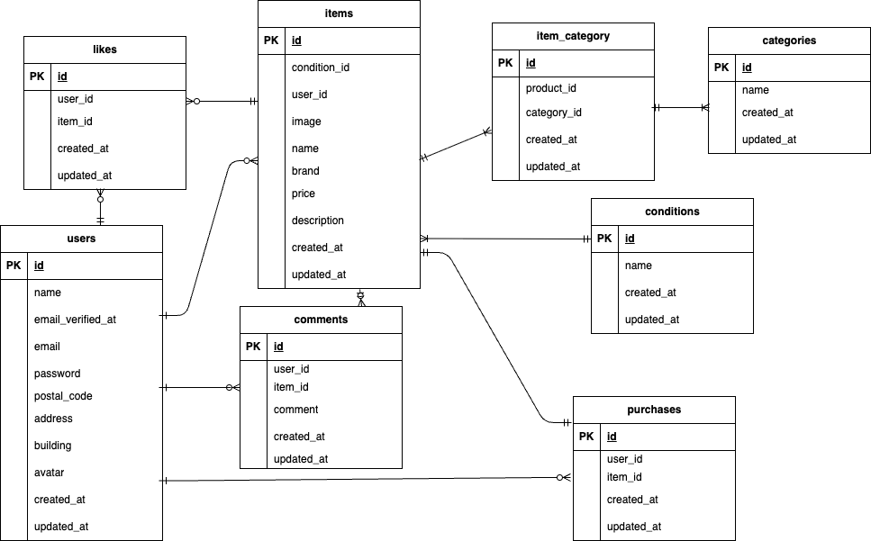

# coachtechフリマ

##　環境構築

Dockerビルド
1 cd coachtech/laravel

2 git clone git@github.com:Estra-Coachtech/laravel-docker-template.git

3 mv laravel-docker-template Furima

4 cd Furima

5 DockerDesktopアプリを立ち上げる

6 docker-compose up -d --build

Laravel環境構築

1docker-compose exec php bash

2 composer install

3 「.env.example」ファイルを　「.env」ファイルに命名を変更。または、新しく.envファイルを作成

4 .envに以下の環境変数を追加

DB_CONNECTION=mysql

DB_HOST=mysql

DB_PORT=3306

DB_DATABASE=laravel_db

DB_USERNAME=laravel_user

DB_PASSWORD=laravel_pass

5 アプリケーションキーの作成
php artisan key:generate

6 マイグレーションの実行
php artisan migrate

7 シーディングの実行
php artisan db:seed

## 使用技術
・Laravel 8.x
・PHP 7.3+
・MySQL8.0.26

## ER図

## 開発環境

・商品一覧画面： http://localhost/

・ログイン画面： http://localhost/login

・phpMyAdmin： http://localhost:8080/

